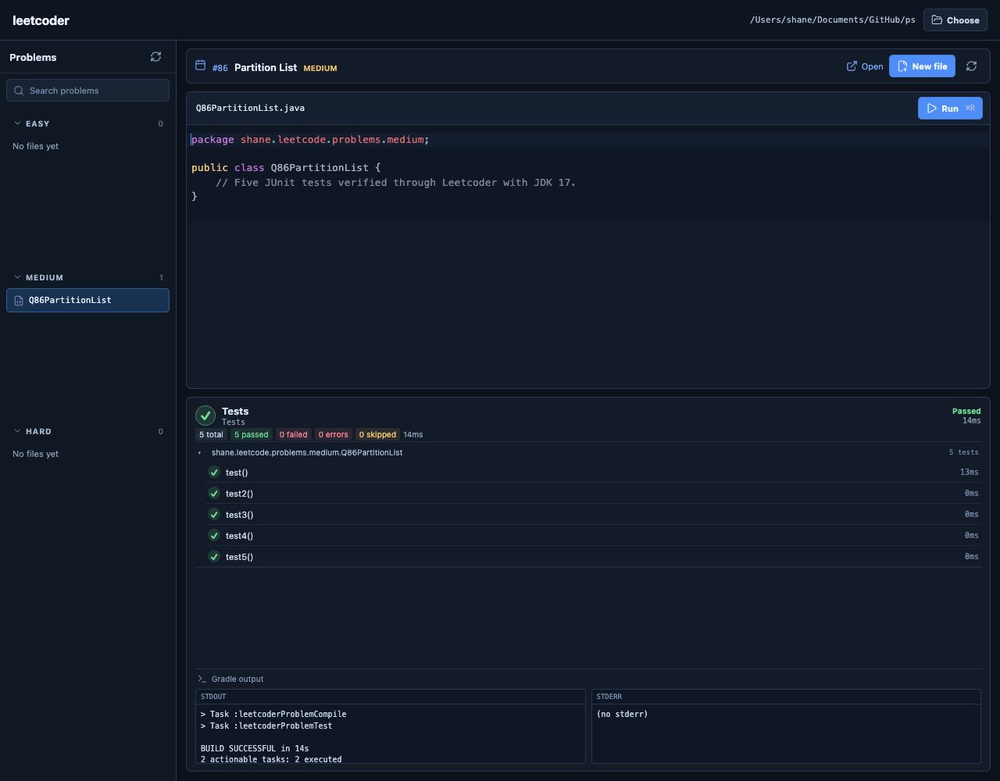

# leetcoder

leetcoder is a small Tauri desktop editor for the Java solutions in this
repository. It is intentionally focused on the daily workflow: load the
current LeetCode problem, create the next problem class in the matching
package, edit it, and run that class's JUnit test.

The app currently supports this repository only. It does not try to replace a
general-purpose Java IDE.

<div align="center">
  
  <h2>A focused, friendly workspace for daily Java problem practice</h2>
  <p>Load a problem, write the solution, and run its tests from one small desktop app.</p>
</div>

<p align="center">
  
</p>

<p align="center"><sub>Example workflow: edit a problem and see every test pass in the results panel.</sub></p>

## Requirements

### macOS

- A supported macOS release.
- Xcode Command Line Tools (`xcode-select --install`).
- Rust stable installed through [rustup](https://rustup.rs/).
- Node.js 22 LTS (Vite 7 requires Node 20.19+ or 22.12+).

### Ubuntu

The commands below are the Tauri 2 WebKitGTK prerequisites used by CI on
Ubuntu 24.04:

```bash
sudo apt-get update
sudo apt-get install -y \
  build-essential curl wget file libssl-dev libxdo-dev \
  libayatana-appindicator3-dev librsvg2-dev \
  libwebkit2gtk-4.1-dev
```

On Ubuntu 22.04, use `libwebkit2gtk-4.0-dev` in place of
`libwebkit2gtk-4.1-dev` when the 4.1 package is not available. Install Rust
stable with rustup and Node.js 22 LTS as well.

The Tauri CLI is installed locally by `npm ci`; a global Tauri installation is
not required.

### JDK for running repository tests

The selected `ps` repository uses Java 11 source/target compatibility and its
Gradle wrapper is Gradle **7.3.3**. Leetcoder prefers a JDK 17 runtime for
running problems and falls back to JDK 11 when JDK 17 is not installed. Newer
JDKs, such as JDK 25, are not selected because they are outside the supported
range for this Gradle wrapper.

Check the environment before opening the app:

```bash
java -version
./gradlew --version
```

Both commands should use the intended JDK, and the wrapper should report
Gradle 7.3.3. For example, on macOS with multiple JDKs installed:

```bash
export JAVA_HOME=$(/usr/libexec/java_home -v 17)
export PATH="$JAVA_HOME/bin:$PATH"
```

The desktop app inherits this environment when it is started from that
terminal. If JDK 17 is unavailable, set `JAVA_HOME` to the JDK 11 installation
and start the app from the same shell. The app also discovers installed JDKs
and selects the highest supported version up to JDK 17 automatically.

## Install and run

From this repository root:

```bash
npm ci
npm run tauri -- dev
```

`npm ci` is intentional: `package-lock.json` is committed and should define
the frontend dependency versions. The Tauri development command starts Vite
and the native desktop window together.

For a browser-only frontend session, use `npm run dev`. Native repository
features such as the folder picker, file access, and Gradle test runner are
available only in the Tauri app.

## Frontend checks and native build

Run the frontend checks from the repository root:

```bash
npm run typecheck
npm test
npm run build
```

Build an unsigned native bundle with the Tauri CLI:

```bash
npm run tauri -- build
```

Bundles are written under
`src-tauri/target/release/bundle/`. The build does not publish a
release or upload anything. Signing and release automation are deliberately
outside the MVP.

Rust checks can be run independently:

```bash
cd src-tauri
cargo fmt --all -- --check
cargo test
cargo check
```

## Daily workflow

1. Open leetcoder and choose the `ps` repository root (the directory containing
   `build.gradle`, `settings.gradle`, and `gradlew`). The app validates the
   expected `src/main/java/shane/leetcode/problems/{easy,medium,xhard}`
   directories and remembers the selected path locally.
2. The Today card loads the daily problem through LeetCode's GraphQL endpoint.
   Use the refresh button to request it again, or open the problem link in a
   browser.
3. Select **New problem file**. The difficulty is mapped as follows:

   | LeetCode difficulty | Java package |
   | --- | --- |
   | Easy | `shane.leetcode.problems.easy` |
   | Medium | `shane.leetcode.problems.medium` |
   | Hard | `shane.leetcode.problems.xhard` |

   The class name follows the repository's `ClassNameFactory` convention. If
   the name already exists, the app creates the first available suffix:
   `Q3622CheckDivisibilityByDigitSumAndProduct`, then `...2`, `...3`, and so
   on. Existing Java and Kotlin files in the destination package participate
   in collision detection, and no confirmation is requested.
4. The created file opens immediately in the editor. CodeMirror provides Java
   syntax highlighting, bracket/indent behavior, and a small built-in
   completion list. Save with **Save** or `Cmd/Ctrl+S`.
5. Run the current class with **Run test** or `Cmd/Ctrl+R`. Unsaved changes are
   saved first; stdout and stderr appear in the Output panel.

### Generated scaffold

When LeetCode returns a Java snippet, the first method signature is extracted
and inserted without its body. For example, the daily problem above starts as
follows:

```java
package shane.leetcode.problems.easy;

import org.junit.jupiter.api.Test;

import static org.assertj.core.api.Assertions.assertThat;

public class Q3622CheckDivisibilityByDigitSumAndProduct {

    @Test
    public void test() {
        assertThat()
    }

    public boolean checkDivisibility(int n) {

    }
}
```

The static AssertJ import and JUnit import are included automatically. The
scaffold is intentionally incomplete: `assertThat()` has no argument and the
solution method has no body, so fill in the assertion and implementation
yourself.

If the daily response has no Java snippet, the app still creates the class,
package, imports, and `@Test` method, but leaves out the solution method. Add
the method declaration and body directly in the editor.

### How Run test works

Problem files in this repository live in `src/main/java`, while the test
method is in the same class. The app therefore does not edit `build.gradle` or
add a permanent Gradle task. For each run it creates a short init script in a
temporary directory and invokes the repository wrapper approximately as:

```bash
./gradlew \
  --init-script /temporary/leetcoder-init.gradle \
  leetcoderProblemTest \
  --tests shane.leetcode.problems.easy.Q3622CheckDivisibilityByDigitSumAndProduct
```

That temporary task uses the main source-set output, the test runtime
classpath, and JUnit Platform, then the script is removed. The wrapper,
dependencies, and JDK still come from the selected repository and local
environment, so Gradle 7.3.3 with JDK 17 (or the JDK 11 fallback) is important
for reliable runs.

## CI

`.github/workflows/leetcoder.yml` runs for repository changes and can also be
started with **workflow_dispatch**. It
uses a macOS and Ubuntu matrix to run frontend typecheck/test/build, Rust
format/test/check, and the native `npm run tauri -- build`. Ubuntu installs the
WebKitGTK and other Tauri build dependencies first.

CI uploads the generated bundle directory as a workflow artifact for
inspection. It does not create a GitHub release, sign packages, or publish
artifacts.

## Known limitations

- The app is scoped to this `ps` repository and its current directory layout.
- The daily problem request is best-effort and uses LeetCode's unauthenticated
  GraphQL endpoint. LeetCode can change that endpoint or reject requests; the
  app has no login flow, submission flow, or guaranteed offline cache.
- A missing or unparseable Java snippet falls back to a class plus the JUnit
  `@Test` scaffold. The solution method must then be written manually.
- New files intentionally start in a non-compiling state so the editor opens
  at the same place the daily practice normally begins.
- Completion is deliberately lightweight. There is no Java language server,
  full refactoring suite, formatter, debugger, or code submission.
- Test execution depends on the repository's Gradle wrapper, downloaded
  dependencies, and the inherited JDK 17 environment (with JDK 11 as a
  fallback).
