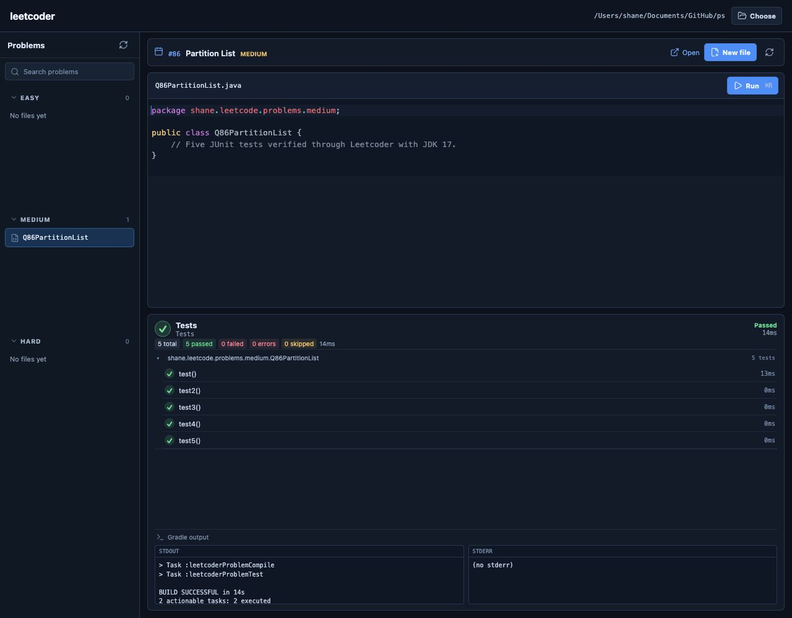

# leetcoder

A focused Tauri desktop editor for Java solutions in the `ps` repository:
load a problem, create its class, edit the solution, and run its JUnit tests.
The app supports that repository's layout rather than arbitrary Java projects.

<p align="center">
  
  <br />
  
</p>

See [architecture and work ownership](docs/architecture.md) for module boundaries,
[the performance audit](docs/performance.md) for measured results and caveats,
and [AGENTS.md](AGENTS.md) for contribution policy.

## Requirements

Use Rust stable through [rustup](https://rustup.rs/) and Node.js 22 LTS
(Vite 7 requires Node 20.19+ or 22.12+). On macOS, install Xcode Command Line
Tools with `xcode-select --install`. Ubuntu 24.04 needs the Tauri 2 prerequisites
used by CI:

```bash
sudo apt-get update
sudo apt-get install -y \
  build-essential curl wget file libssl-dev libxdo-dev \
  libayatana-appindicator3-dev librsvg2-dev libwebkit2gtk-4.1-dev
```

The native build requires WebKitGTK 4.1; the older 4.0 package is not a
substitute. The Tauri CLI is local to the project; `npm ci` installs it.

The selected `ps` repository uses Java 11 source/target compatibility and
Gradle **7.3.3**. The app prefers JDK 17 and falls back to JDK 11; newer JDKs
such as JDK 25 are outside that wrapper's supported range. Check in the
selected repository:

```bash
java -version
./gradlew --version
```

For multiple macOS JDKs, select the environment before launching from that shell:

```bash
export JAVA_HOME=$(/usr/libexec/java_home -v 17)
export PATH="$JAVA_HOME/bin:$PATH"
```

Use the JDK 11 installation if 17 is unavailable. The desktop app inherits
its launch environment and also discovers the highest supported installed JDK
up to 17.

## Install, run, and build

From this repository root:

```bash
npm ci
npm run tauri -- dev
```

`npm ci` uses the committed lockfile. The Tauri development command starts
Vite and the desktop window together. `npm run dev` starts a browser-only
frontend; native folder picking, file access, and Gradle execution require Tauri.

Frontend checks are:

```bash
npm run typecheck
npm test -- --maxWorkers=1
npm run build
```

Run disposable Rust checks in a temporary target, with incremental compilation
disabled; remove it afterward. The development profile retains this crate's
line tables and omits dependency debug information. Use `--profile debugging`
when full debug information is needed.

```bash
(
  export CARGO_TARGET_DIR="$(mktemp -d /tmp/leetcoder-check.XXXXXX)"
  export CARGO_INCREMENTAL=0 CARGO_BUILD_JOBS=1
  trap 'rm -rf "$CARGO_TARGET_DIR"' EXIT
  cargo fmt --manifest-path src-tauri/Cargo.toml --all -- --check
  cargo test --manifest-path src-tauri/Cargo.toml -- --test-threads=1
  cargo check --manifest-path src-tauri/Cargo.toml
)
```

`npm run tauri -- build` creates an unsigned native bundle under
`src-tauri/target/release/bundle/`. It does not install, sign, or publish a release.
To build, atomically install, and restart the application used by the desktop
launcher, run:

```bash
npm run rebuild
```

This replaces `/Applications/leetcoder.app` on macOS, or installs an AppImage
and desktop entry under the Linux user's `~/.local` directories. The build and
launch log is `leetcoder-rebuild.log` in the system temporary directory.
A frontend build alone does not update the installed app. Production rebuilds
intentionally use the persistent `src-tauri/target` path; preserve it for this
workflow.

## Daily workflow

1. Choose the `ps` root containing `build.gradle`, `settings.gradle`, and
   `gradlew`. The app validates
   `src/main/java/shane/leetcode/problems/{easy,medium,xhard}` and remembers
   the selected path locally.
2. The Today card requests the daily problem through LeetCode GraphQL.
   Refresh to request it again, or open its link in a browser.
3. Select **New problem file**. Easy maps to `shane.leetcode.problems.easy`,
   Medium to `.medium`, and Hard to `.xhard`. Class names follow the
   repository's `ClassNameFactory` convention. Collisions use the first
   available suffix (`Q3622CheckDivisibilityByDigitSumAndProduct`, then
   `...2`, `...3`, etc.), including existing Java and Kotlin files; no
   confirmation is requested.
4. Edit the created file with Java highlighting, completions, and editing
   actions. Save with **Save**; the in-app shortcut list shows the current
   platform bindings, defined in [src/shortcuts.ts](src/shortcuts.ts).
5. Run the test at the cursor or all tests in the current class. Unsaved
   changes are saved first; stdout and stderr appear in Output.

### Generated scaffold and test execution

The first method signature from a Java snippet is inserted without its body,
alongside JUnit and AssertJ imports:

```java
package shane.leetcode.problems.easy;

import org.junit.jupiter.api.Test;
import static org.assertj.core.api.Assertions.assertThat;

public class Q3622CheckDivisibilityByDigitSumAndProduct {
    @Test
    public void test() {
        assertThat()
    }

    public boolean checkDivisibility(int n) {

    }
}
```

The scaffold intentionally does not compile until you fill in the assertion
and solution. A missing or unparseable Java snippet creates the class, imports,
and `@Test` method; add the solution method yourself.

Problem tests live alongside solutions in `src/main/java`. Each run creates a
temporary Gradle init script rather than modifying `build.gradle` or installing
a permanent task:

```bash
./gradlew --init-script /temporary/leetcoder-init.gradle \
  leetcoderProblemTest \
  --tests shane.leetcode.problems.easy.Q3622CheckDivisibilityByDigitSumAndProduct
```

The task uses main source-set output, the test runtime classpath, and JUnit
Platform. The script is removed afterward. Execution depends on the selected
repository's wrapper, downloaded dependencies, and supported JDK.

## CI and limitations

[The CI workflow](.github/workflows/leetcoder.yml) runs on pushes and pull
requests to `main`, or manually with `workflow_dispatch`. Its macOS/Ubuntu
matrix runs frontend typecheck/test/build, Rust format/test/check, and the
native bundle build; Ubuntu first installs the dependencies above. Bundles
are uploaded as workflow artifacts, without signing or publishing releases.

The app has no login, submission, or guaranteed offline cache. Daily requests
use an unauthenticated endpoint that may change or reject requests. Java
completion, formatting, and refactoring are lightweight; there is no Java
language server or debugger. Repository layout and local Gradle/JDK
requirements remain part of the supported workflow.
