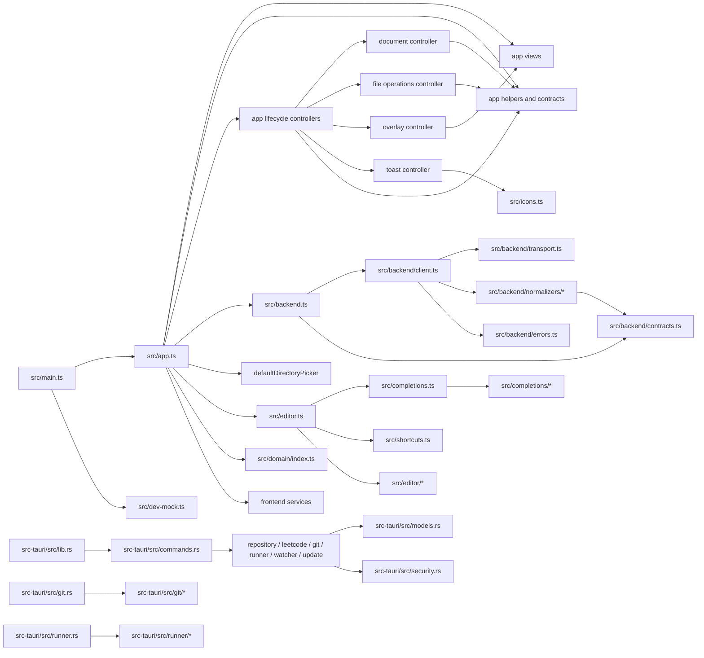

# Architecture and parallel work

This document describes the current module boundaries in leetcoder. It is the
working map for assigning parallel changes: each change should have one owner
for every path it writes, and dependencies should flow through the boundaries
below.

## Runtime shape

`src/main.ts` starts the Vite frontend and creates `LeetcoderApp` from
`src/app.ts`. The app owns state, lifecycle, and DOM event orchestration while
the daily-problem, file-explorer, Git-panel, test-result, and shell views own
their local rendering through view models and callbacks. Problem selection,
repository, Git, and test operations go through the `BackendClient` exposed by
`src/backend.ts`. The one native picker exception is `defaultDirectoryPicker`
in `app.ts`, which invokes `choose_repository` directly; the injected
`directoryPicker` option keeps that UI boundary testable.
`src/dev-mock.ts` supplies the browser preview implementation. The native
entrypoint, `src-tauri/src/lib.rs`, registers Tauri commands from
`src-tauri/src/commands.rs`; those commands delegate to native feature modules
and return the serde models in `src-tauri/src/models.rs`.

The frontend and native halves meet at command names, argument shapes, event
names, and serialized result shapes. Keep that boundary explicit when a
feature crosses the halves.

## Module map

| Area | Paths | Responsibility | Depends on |
| --- | --- | --- | --- |
| Bootstrap | `src/main.ts`, `src/dev-mock.ts` | Choose native or browser dependencies, install the close handler, and start the app. | App and backend public surfaces |
| App controller | `src/app.ts` | Own the single-window state, repository selection/refresh/watch lifecycle, DOM event wiring, rendering composition, and integration of view/controller callbacks. `LeetcoderApp` is the application entry class; document/tab/autosave, file mutations, overlays/toasts, problem selection, Git, test-run, and pane lifecycles are delegated to focused controllers/views. | App views/helpers/controllers, backend, editor, domain, update and diagnostics services |
| App contracts and helpers | `src/app/types.ts`, `autosave.ts`, `navigation.ts`, `path-helpers.ts`, `file-helpers.ts`, `file-index.ts`, `git-helpers.ts`, `layout.ts`, `test-results.ts` | Hold app state types and keep autosave, navigation, path matching, file indexing, Git/file presentation, layout persistence, and test-result interpretation independently testable. | Backend types, domain types, and small frontend utilities |
| App lifecycle controllers | `src/app/document-controller.ts`, `file-operations-controller.ts`, `git-controller.ts`, `overlay-controller.ts`, `pane-layout.ts`, `problem-selection-controller.ts`, `test-run-controller.ts`, `toast-controller.ts` | Own selected-document/tab/autosave/external-reload lifecycle; create/delete/duplicate/rename/discard/show-in-manager mutations; Git status/diff/commit/push guards; application overlays and their focus/theme state; resizable pane persistence; daily/manual problem lookup with date rollover retries; test-run progress/selection; and toast DOM/timers. Typed callbacks keep these controllers independent from the app shell while `app.ts` retains repository and render/event composition. | App contracts/helpers, backend contracts, and small DOM callbacks |
| App views | `src/app/daily-view.ts`, `files-view.ts`, `git-view.ts`, `results-view.ts`, `shell-view.ts`, `dialogs-view.ts`, `tabs-view.ts` | Render each UI surface from a narrow view model and send user actions to the owning controller through callbacks. `daily-view.ts` retains its sanitized-description DOM cache; `git-view.ts` owns Git row rendering and selection-set construction; `files-view.ts` owns search/group rendering; `dialogs-view.ts` owns app-menu, dialog, and context-menu DOM rendering; `tabs-view.ts` owns the open-file tab strip and its short-lived DOM work. | App/domain DTOs, app helpers, icons, sanitization, and shortcut labels as appropriate |
| Frontend backend boundary | `src/backend.ts`, `src/backend/contracts.ts`, `src/backend/client.ts`, `src/backend/transport.ts`, `src/backend/errors.ts` | Keep `src/backend.ts` as the compatibility barrel; define frontend DTOs and `BackendClient` in `contracts.ts`; compose command calls in `client.ts`; isolate Tauri invoke/listen/channel details in `transport.ts`; keep error classification in `errors.ts`. | Domain `ProblemFilePlan` and Tauri APIs |
| Backend response adapters | `src/backend/normalizers/{common,problem,files,git,test}.ts` | Convert native and older response shapes into frontend contracts. `common.ts` owns shared guards and primitive coercions. | Backend contracts and common helpers |
| Problem domain | `src/domain/index.ts`, `class-name.ts`, `method-signature.ts`, `problem-file.ts`, `public.ts`, `template.ts` | Pure naming, difficulty/package mapping, Java method extraction, scaffold planning, and source rendering. | TypeScript standard library only |
| Editor | `src/editor.ts`, `src/editor/{editing,intentions,statement-completion,definition-navigation,theme,test-markers,gutters}.ts` | Keep the `JavaEditor` CodeMirror facade and keymap/wiring in `editor.ts`; separate editing commands, missing-method creation and its action menu, statement completion, definition navigation, theme, diagnostics/gutters, and syntax-based test markers into focused modules. | Completions, Java format/refactor, clipboard, shortcuts, CSS variables |
| Completions | `src/completions.ts`, `src/completions/{model,source,imports,templates}.ts` | Keep the completion facade and catalog while separating Java metadata, source analysis, import edits, and snippet/template behavior. `source.ts` exposes an internal `JavaSourceAnalysis` so one completion/definition request can reuse its masked source, symbols, and methods. | CodeMirror and Java completion model |
| Frontend services | `src/problem-generator.ts`, `src/live-diagnostics.ts`, `src/update-controller.ts`, `src/update-progress.ts`, `src/java-format.ts`, `src/java-refactor.ts`, `src/clipboard.ts`, `src/icons.ts`, `src/sanitize.ts` | Coordinate retries, debounced compiler snapshots, updates, Java transformations, clipboard access, icons, and safe problem markup. | Backend/domain/editor boundaries as appropriate |
| Native wiring and shared models | `src-tauri/src/lib.rs`, `commands.rs`, `models.rs` | Register commands, adapt command arguments, and define serialized native DTOs. Keep this layer thin. | Native feature modules and Tauri |
| Native repository and network features | `src-tauri/src/repository.rs`, `leetcode.rs`, `watcher.rs`, `update.rs`, `security.rs` | Validate and mutate repository files, fetch LeetCode data, watch source changes, perform updates, and enforce path/symlink containment. | `models.rs`; security is shared by filesystem-facing features |
| Native Git | `src-tauri/src/git.rs`, `src-tauri/src/git/{commit,diff,path,process,push,service,status,tests}.rs` | Keep the root as a small facade. Separate commit, diff, path validation and changed-path selection, process capture, push, orchestration, status parsing, and Git tests. `path.rs` returns the one status snapshot shared by selection and diff; `commit.rs` batches existing-file staging while retaining per-path handling for deletions. | Native models, security, and the Git executable |
| Native test runner | `src-tauri/src/runner.rs`, `src-tauri/src/runner/{diagnostics,gradle,java,junit,process,service,tests,validation}.rs` | Keep the root as the internal runner facade. Separate compiler diagnostics, Gradle setup, JDK selection, JUnit parsing, process/progress capture, orchestration, tests, and Java/FQCN validation. | Native models, security, Java/Gradle/JUnit tools |
| Styles | `src/styles.css`, `src/styles/{theme,base,buttons,shell,sidebar,problem,editor,bottom-panel,results,git,update,toasts,context-menu,dialogs}.css` | Keep one CSS entrypoint and split selectors by surface. The import order in `styles.css` is part of the cascade contract; `theme.css` owns tokens used by the CodeMirror theme. | CSS variables and the DOM class contract |

## Dependency direction

The high-level direction is UI → frontend services/contracts → native
commands → native features. Pure layers stay below the layers that orchestrate
them.



`src/app.ts`, `src/editor.ts`, `src/completions.ts`, `src/backend.ts`,
`src-tauri/src/git.rs`, and `src-tauri/src/runner.rs` are public or wiring
facades. Feature code belongs in their owned submodules when a boundary
already exists. The app may compose lower-level modules; lower-level modules
must not import app state or DOM code. App views receive DTOs and callbacks;
they do not reach into `LeetcoderApp`, backend clients, or repository state.

## Public contracts

- Import frontend backend DTOs and `BackendClient` from `src/backend.ts`.
  Their definitions live only in `src/backend/contracts.ts`. `client.ts` is
  the only normal frontend implementation of native command calls, and
  `transport.ts` is the only place that owns the default Tauri bridge for
  `BackendClient` commands, events, and progress channels. The app-level
  `choose_repository` picker remains the explicit exception described above.
- Import `LeetcoderApp` and compatibility app helpers from `src/app.ts`.
  `src/app/types.ts`, the helper modules, and the view modules are
  implementation boundaries; preserve the app barrel when moving code so
  existing consumers and tests do not need path churn. Views are internal
  unless a consumer explicitly needs a focused renderer.
- Import `JavaEditor` and editor actions from `src/editor.ts`, and completion
  APIs from `src/completions.ts`. The editor submodules are internal
  implementation modules re-exported by the facade where compatibility
  requires it. Keep keymap and platform matcher wiring in `editor.ts` aligned
  with `src/shortcuts.ts`.
- Import domain planning APIs from `src/domain/index.ts`. Domain code must
  remain usable without the DOM, Tauri, or CodeMirror.
- Import completion analysis helpers only from their owning completion module
  when writing focused tests. `JavaSourceAnalysis` is an internal coordination
  value; the public completion facade should continue to expose the existing
  completion and Java-source APIs.
- Native command names and argument serialization are defined by the
  `#[tauri::command]` functions in `src-tauri/src/commands.rs` and registered
  in `src-tauri/src/lib.rs`. Shared wire DTOs live in `models.rs`; changing
  one requires updating the frontend contract/client and its tests together.
- `src/shortcuts.ts` is the single shortcut definition surface. Keep the
  platform matcher in `src/editor.ts` aligned with it, following the existing
  keyboard policy in `AGENTS.md`.
- `src/styles.css` is the only stylesheet entrypoint. Preserve its ordered
  imports when moving selectors between partials.

## Frontend test ownership

Each focused test file has one owner. The split suites keep feature changes
from contending on a single large test file while the app, editor, and
completion facades remain available for compatibility coverage.

| Feature | Focused tests | Shared fixture/contract notes |
| --- | --- | --- |
| App state and views | `tests/frontend/app/{app-lifecycle,autosave,document-controller,file-actions,file-index,file-operations-controller,git-controller,git-presentation,git-progress,git-selection,layout,navigation,overlay-controller,pane-layout,problem-lifecycle,problem-selection-controller,tabs-view,test-results,test-run-controller,toast-controller}.test.ts` | `app.ts` integration changes and the public app lifecycle suite are owned together; focused controller/view suites exercise document saving and reloads, file mutations, Git, overlays/toasts, problem selection, and test lifecycles, pane persistence, tab rendering, file indexing, and Git selection directly. |
| Completion catalog and analysis | `tests/frontend/completions/{catalog,source,templates}.test.ts`, `tests/frontend/completions-analysis.test.ts` | `tests/frontend/completions/helpers.ts` is a read-only shared fixture helper. `source.ts` analysis changes and its focused test should be integrated together. |
| Editor | `tests/frontend/editor/{commands,imports,javadoc,refactoring,shortcuts,templates,test-markers}.test.ts` | `tests/frontend/editor/helpers.ts` is a read-only shared fixture helper. `editor.ts` remains the facade/integration owner. |
| Backend adapters and transport | `tests/frontend/backend/{files-problem,git,test-results,transport-client}.test.ts` | Assign one adapter owner per normalizer and keep transport/client changes with their focused test. |
| Other frontend services | `tests/frontend/{capability,icons,java-format,java-refactor,live-diagnostics,problem-generator,rebuild-script,result-presentation,shortcuts,update}.test.ts` | These suites remain separate from app/editor/completion feature ownership. |
| Native Git and runner | `src-tauri/src/git/tests.rs`, `src-tauri/src/runner/tests.rs` | Embedded tests stay with their native feature tree; command/model wiring changes integrate sequentially. |

## Ownership for parallel work

Give each agent a concrete path set and a verification command before work
starts. A useful assignment has this shape:

```text
Owner: Git response adapter
Paths: src/backend/normalizers/git.ts, tests/frontend/backend/git.test.ts
Reads: src/backend/contracts.ts, src-tauri/src/models.rs
Depends on: the existing BackendClient contract
Checks: the focused backend tests, then npm run typecheck
```

The same assignment pattern applies to a CSS partial:

```text
Owner: test-results styles
Paths: src/styles/results.css
Reads: src/styles/theme.css, src/styles/bottom-panel.css
Depends on: the existing DOM class names and ordered styles.css entry
Checks: npm run build
```

Use these ownership boundaries:

- A domain owner handles `src/domain/**` and `tests/domain/**`.
- An app-helper owner handles one or more files under `src/app/**` and the
  focused tests that exercise those helpers. Assign `daily-view.ts`,
  `files-view.ts`, `git-view.ts`, `git-controller.ts`, `document-controller.ts`,
  `file-operations-controller.ts`, `overlay-controller.ts`, `pane-layout.ts`,
  `problem-selection-controller.ts`, `tabs-view.ts`, `test-run-controller.ts`,
  `toast-controller.ts`, and `file-index.ts` independently when their
  callback/model contracts do not overlap. The app controller and its public
  exports have one integration owner; view wiring and changes to
  `src/app/types.ts` are integrated through that owner.
- A contract owner handles `src/backend/contracts.ts` and contract-facing
  checks. A client/transport owner handles `src/backend/client.ts`,
  `transport.ts`, `errors.ts`, and
  `tests/frontend/backend/transport-client.test.ts`. Response adapters can
  then be assigned independently: one owner for `normalizers/problem.ts`,
  one for `normalizers/files.ts`, one for `normalizers/git.ts`, and one for
  `normalizers/test.ts`, each with its focused test file where one exists.
  `normalizers/common.ts` has one owner because its helpers are shared by all
  adapters. Keep `src/backend.ts` as a single facade/integration owner. The
  existing `files-problem.test.ts` covers both problem and file adapters, so it
  also has one owner unless a separate test file is created before parallel
  edits.
- An editor owner handles one focused module under `src/editor/**` and its
  matching split test file where possible. `editing.ts`,
  `statement-completion.ts`, `definition-navigation.ts`, `theme.ts`,
  `test-markers.ts`, and `gutters.ts` are leaf boundaries; `editor.ts` owns
  the `JavaEditor` facade, keymap assembly, and platform matcher wiring.
- A completion owner handles one focused module under `src/completions/**`
  and its split suite. `source.ts` owns the internal shared analysis contract;
  changes to `JavaSourceAnalysis` must be integrated with its callers in
  `completions.ts` and `templates.ts` before the focused analysis test is
  updated. `completions.ts` remains the facade/integration owner.
- Native feature owners handle their own module trees and embedded tests:
  Git owns `src-tauri/src/git/**`, and the runner owns
  `src-tauri/src/runner/**`. Within Git, `path.rs` owns the changed-path
  selection/status snapshot contract consumed by `diff.rs` and `commit.rs`;
  changes to that contract integrate those consumers sequentially. The
  command/model wiring owner handles `commands.rs`, `models.rs`, and `lib.rs`
  sequentially.
- `src/styles.css` has one entry-list/integration owner. Each partial under
  `src/styles/**` can have a separate owner: for example, `results.css`,
  `git.css`, and `dialogs.css` are independent selector sets. `theme.css`
  shares variables with `src/editor/theme.ts`, so those paths should be
  assigned together or integrated sequentially. A partial owner does not
  reorder the entry list; the entry owner resolves cross-partial moves and
  preserves the cascade.

Agents may read shared contracts in parallel. Only the contract owner edits a
shared contract. If a contract or serialized DTO must change, pause dependent
streams, update the contract and its direct implementation, then integrate
consumers and tests in order. Do not assign two agents the same path or the
same existing test file. Cross-cutting facade, wiring, and integration changes
belong to one integrator after the leaf work is complete.

## Change and verification flow

1. Record the owner, exact paths, dependency assumptions, and focused checks.
2. Implement independent pure leaves in parallel. Keep each leaf's public
   function and type changes visible to its owner and the integrator.
3. Integrate facades and native wiring sequentially, preserving the command,
   DTO, event, and barrel contracts.
4. Run focused checks for each owner, then the repository checks:

   ```bash
   npm run typecheck
   npm test
   npm run build
   cargo fmt --manifest-path src-tauri/Cargo.toml --all -- --check
   cargo test --manifest-path src-tauri/Cargo.toml
   cargo check --manifest-path src-tauri/Cargo.toml
   ```

5. After source changes, run `npm run rebuild` so the installed desktop
   application uses the verified frontend and native binary. Report the
   rebuild result separately from browser build and unit-test results.
