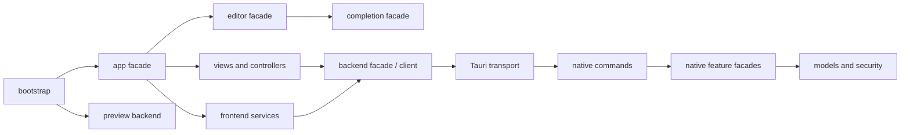

# Architecture and parallel work

This is the current map of module responsibilities, dependency direction,
public facades, and work ownership. [AGENTS.md](../AGENTS.md) supplies repository
policy; [README.md](../README.md) covers setup and builds. Assign one writer
per source path and existing test file, including shared fixtures and contracts.

## Runtime and dependency direction

`src/main.ts` creates `LeetcoderApp` from `src/app.ts`, selects native or browser
preview dependencies, and installs the close handler. The app composes views,
controllers, services, and the editor. Surface renderers receive narrow models
and callbacks without reaching into the app or backend. Controllers and the
shell-control adapter use app contracts; the app connects their state and
callbacks to render/event composition.

Operations cross `BackendClient` through `src/backend.ts`. Its client normalizes
responses and uses the transport's Tauri invoke/listen/channel bridge.
`defaultDirectoryPicker` in `app.ts` is the explicit exception: it invokes
`choose_repository` directly, with an injected `directoryPicker` for tests.
`src/dev-mock.ts` supplies browser preview behavior. Native commands are
registered in `src-tauri/src/lib.rs`, delegate to native feature facades, and
serialize the models from `src-tauri/src/models.rs`.


```mermaid
flowchart LR
  main[bootstrap] --> app[app facade]
  main --> mock[preview backend]
  app --> ui[views and controllers]
  app --> editor[editor facade]
  editor --> completions[completion facade]
  app --> services[frontend services]
  ui --> backend[backend facade / client]
  services --> backend
  backend --> transport[Tauri transport]
  transport --> commands[native commands]
  commands --> features[native feature facades]
  features --> models[models and security]
```

Pure domain, scanning, and planning code stays below orchestration and must not
import app state or DOM code. Controllers may use app contracts, but do not
import `LeetcoderApp`. Existing facades remain compatibility and integration
points; put feature implementation in their owned submodules.

## Module map

Paths in a row share its responsibility, but directories are not blanket write
claims. Choose exact files before assigning independent work.

| Boundary | Paths | Responsibility and dependencies |
| --- | --- | --- |
| Bootstrap and preview | `src/main.ts`, `src/dev-mock.ts`, `src/dev-mock/` | Start the app through public app/backend surfaces; preview leaves own backend behavior, fixtures, runtime callbacks, storage, and test simulation. |
| App composition | `src/app.ts`, `src/app/types.ts` | Single-window state, controller composition, event/render wiring, compatibility exports, shared app types. Depends on controllers, views, backend, editor, domain, diagnostics, and updates. |
| App controllers | `src/app/*-controller.ts`, `pane-layout.ts` | Document/tab/autosave/reload, file mutations, Git status/diff/commit/push guards, overlays/focus/theme, daily/manual selection/date retries, test progress/selection, toasts, pane persistence, repository lifecycle, explorer selection, live diagnostics, search, and library metadata. Use typed callbacks and app/backend contracts. |
| App views and helpers | `src/app/*-view.ts`, `autosave.ts`, `navigation.ts`, `file-index.ts`, `file-helpers.ts`, `path-helpers.ts`, `git-helpers.ts`, `git-progress.ts`, `layout.ts`, `test-results.ts`, `project-search-location.ts` | Local rendering and pure state/presentation helpers. Daily descriptions retain a sanitized DOM cache; files own search/group rendering; Git owns rows/selection sets; dialogs own menu/dialog DOM; tabs own their strip's transient DOM. |
| Backend boundary | `src/backend.ts`, `src/backend/{contracts,client,transport,errors}.ts`, `src/backend/normalizers/` | Compatibility barrel; DTOs and `BackendClient`; command composition; invoke/events/progress; error classification; native/older-response adaptation. Normalizers share guards/coercions in `common.ts`. Depends on domain `ProblemFilePlan` and Tauri APIs. |
| Problem domain | `src/domain/` | Naming, difficulty/package mapping, method extraction, scaffold planning/rendering. `index.ts` is the public entry; no DOM, Tauri, or CodeMirror dependencies. |
| Editor | `src/editor.ts`, `src/editor/` | `JavaEditor`, keymap and platform matcher wiring; editing/refactoring, intentions, statement completion, navigation, imports, input behavior, theme, diagnostics/gutters, string-aware paste, syntax-based test markers. Depends on completions, Java transformations, clipboard, shortcuts, and CSS tokens. |
| Completions | `src/completions.ts`, `src/completions/` | Public completion/source APIs and built-in catalog; source masking/symbols/methods, type resolution, imports, templates, library metadata. `JavaSourceAnalysis` coordinates reuse within a request; member inspection is injected. |
| Frontend services | `src/java-refactor/`, `src/problem-generator.ts`, `live-diagnostics.ts`, `update-controller.ts`, `update-progress.ts`, `java-format.ts`, `java-refactor.ts`, `clipboard.ts`, `icons.ts`, `sanitize.ts` | Retries, debounced compiler snapshots, update state/progress, Java transforms, clipboard, icons, safe markup. Use backend/domain/editor boundaries as appropriate. |
| Native wiring | `src-tauri/src/{lib,commands,models}.rs` | Command registration/adaptation and serialized DTOs; thin integration layer over features. |
| Repository | `src-tauri/src/repository.rs`, `src-tauri/src/repository/` | Stable file-operation facade; validation, listing/reading/writing, duplicate filename/type/write orchestration, rename, atomic creation, source names, tests. Filesystem work uses models/security. |
| Java duplicate templates | `src-tauri/src/repository/duplicate.rs`, `src-tauri/src/repository/duplicate/` | Lexer, declarations/signatures, preserved-harness field references, edits, transformation, and tests. Pure template transformation remains separate from repository filesystem writes. |
| Java library metadata | `src/app/{ps-library-controller,java-type-members-controller}.ts`, `src-tauri/src/java_library.rs`, `src-tauri/src/java_library/` | Metadata/member caches, classpaths, fingerprints, bounded helper inspection/processes, embedded helper sources, tests. Uses backend/completion contracts, security, Gradle/JDK tools. |
| Git | `src-tauri/src/git.rs`, `src-tauri/src/git/` | Status, changed-path selection, diff, commit/push, bounded process capture, orchestration, tests. `path.rs` provides one status snapshot to selection/diff; commit batches existing-file staging but handles deletions per path. Uses models/security and Git. |
| Test runner | `src-tauri/src/runner.rs`, `src-tauri/src/runner/` | Validation, JDK discovery, Gradle setup, JUnit parsing, diagnostics, process/progress/cancellation, orchestration, tests. Uses models/security and Java/Gradle/JUnit tools. |
| Search, network, updates, watching | `src-tauri/src/{project_search,leetcode,update,watcher,security}.rs` and owned subtrees | Saved-text search, problem fetching, rebuild/update lifecycle, coalesced file watching, path/symlink containment. Uses models and feature-specific subprocess/network contracts. |
| Styles | `src/styles.css`, `src/styles/` | One ordered CSS entry; partials own theme, base/buttons, shell/sidebar/problem/editor/panels/results/Git/update/toasts/menus/dialogs/search. Theme tokens are shared with the editor theme; import order is a cascade contract. |

The app's integration leaves have explicit ownership:

- `src/app/repository-controller.ts`: picker/remembered repository, watcher lifetime,
  refresh generation guards, and metadata invalidation.
- `src/app/file-dialog-controller.ts`: file/Git menus, confirmation/focus state,
  and mutation callbacks to the file-operation owner.
- `src/app/file-explorer-controller.ts`: expansion, presentation, and guarded
  document/search navigation.
- `src/app/live-diagnostics-controller.ts`: scheduler lifecycle, current-source
  guards, and merging compiler/test issues.
- `src/app/shell-controls-view.ts`: app-internal `AppState` adapter for busy/control
  enablement, bottom-panel tabs, and Git controls without rebuilding focused inputs.

Focused implementation trees keep distinct responsibilities behind their facades:

- `src/completions/source/` owns masking, symbols/iterables, and methods/navigation;
  `catalog.ts` owns built-ins. `src/java-refactor/` owns AST syntax/selection,
  declarations/dataflow, expression types, and edit plans under its shared types.
- `src/editor/intentions/` separates analysis/inference/rendering/planning from the
  CodeMirror menu; `src/editor/editing/` separates refactoring, JavaDoc, clipboard,
  and command behavior. Auto-import and method-call input are independent leaves.
- Native `leetcode/` separates pooled clients/parsing/tests; `update/` separates
  source validation, rebuild/environment setup, progress, and tests.
  `project_search/` and `commands/` retain cohesive implementation with owned tests.
  Runner process leaves separate control/registry, capture/cancellation, and marker
  progress; native Git/runner test trees separate acceptance suites by behavior.

Project search debounces after immediate filename filtering and allows one native
search at a time. It scans saved text without an index, skipping generated
folders, binary/oversized files, and symlinks. Editable problem-file results
navigate to documents; other text results stay sidebar previews.

Ps metadata loads in the background per repository and refreshes after dependency
changes. Type-member inspection batches/caches lazy requests, discards stale
repository/Gradle results, and revalidates known types when the app becomes active.
It reads public method/field signatures without initializing classes; Ps
completion state remains in `src/completions/library.ts`.

## Public contracts and shared wiring

- Frontend consumers import backend DTOs and `BackendClient` from `src/backend.ts`;
  definitions live only in `src/backend/contracts.ts`. Normal command calls
  belong in `client.ts`, and the default bridge in `transport.ts`, with the
  picker exception above.
- Preserve `src/app.ts` exports for `LeetcoderApp` and compatibility helpers,
  `src/editor.ts` exports for `JavaEditor`/actions, `src/completions.ts` for
  completion/source APIs, and `src/domain/index.ts` for domain planning.
  Internal modules may be imported by focused tests; compatibility moves
  must not force caller path churn. `JavaSourceAnalysis` remains internal.
- Preserve native command names, arguments, DTO serialization, and event names.
  Command wrappers live in `commands.rs` and the update facade, registration
  in `lib.rs`, and shared wire models in `models.rs`. A DTO change updates
  frontend contracts/client and native consumers/tests together.
- Define every shortcut in `src/shortcuts.ts`; UI labels use
  `shortcutLabel(id, macPlatform)`. Keep keymap and `event.code` Alt matchers
  in `editor.ts` aligned with the [keyboard policy](../AGENTS.md#keyboard-shortcuts).
  Mac Cmd pairs with Linux Alt; Ctrl twins remain bound, with the documented
  platform-independent exceptions and modifier display ordering.
- Preserve ordered imports in `src/styles.css` and the DOM class contract.
  Coordinate `src/styles/theme.css` with `src/editor/theme.ts`.

## Ownership and focused checks

Claim the owner, exact source/test paths, read-only dependencies, existing
contracts, and focused checks before editing. For example:

```text
Owner: Git response adapter
Writes: src/backend/normalizers/git.ts, tests/frontend/backend/git.test.ts
Reads: src/backend/contracts.ts, src-tauri/src/models.rs
Contract: existing BackendClient / Git DTOs
Checks: focused Git adapter suite; coordinated final typecheck
```

Assign independent leaves and their tests in parallel. App/editor/completion/
backend facades, native facades/registration, public barrels, shared models,
`src/app/types.ts`, `normalizers/common.ts`, and ordered CSS imports each have
one owner. Shared contracts can be read in parallel; changes to them and their
direct implementation precede dependent consumers/tests. Pause dependent streams
while integrating a changed contract. No two writers share an existing test file.

| Workstream | Focused coverage and ownership constraint |
| --- | --- |
| Domain | `tests/domain/`; owner includes the matching domain module. |
| App | `tests/frontend/app/`; assign controller/view/helper suites with their source. Lifecycle, background-services, and project-search integration suites share single-owner `lifecycle-harness.ts` / `lifecycle-mocks.ts`. |
| Backend | `tests/frontend/backend/`; one normalizer per owner. `files-problem.test.ts` covers two adapters and remains single-owner. Client/transport/error work owns `transport-client.test.ts`. |
| Editor | `tests/frontend/editor/`; facade/keymap integration has one owner. `helpers.ts` is a shared read-only fixture unless explicitly assigned. |
| Completions | `tests/frontend/completions/` and `completions-analysis.test.ts`; `helpers.ts` is read-only. Source analysis contracts integrate with facade/template consumers before test changes. |
| Preview | `tests/frontend/dev-mock/`; backend, storage, and test-runner suites match the preview leaves. |
| Services | Their individual suites in `tests/frontend/`, including Java format/refactor, diagnostics, generation, updates, and rebuild-script behavior. Preserve existing javac checks for refactoring. |
| Native features | Tests in each owned feature tree. Repository file/collision/no-clobber/security tests stay acceptance checks; duplicate template tests preserve generated-text assertions. |
| Styles | Own exact partials; entry owner resolves cross-partial moves and order. Check build and affected UI behavior after integration. |

Some internal contracts require sequential integration even within a feature:
Git status/path snapshots; metadata caches/fingerprints/process output/helper
schemas; completion analysis values; duplicate token/member contracts. Duplicate
dependencies flow from transformation to references/syntax/edits, references to
syntax, and syntax/edits to lexer. Keep each cache/subprocess lifetime under its
feature owner. Do not add a common scanner/process abstraction solely because
names look similar: domain/completion masking have different semantics, and
native process limits/cancellation differ.

## Refactoring and verification

The 2026-09-30 responsibility splits are implemented. Verification results and
desktop installation are reported separately; the module map does not establish
either. The app/editor facades remain larger integration boundaries, while
cohesive controllers, completion templates, parsers, acceptance suites, and
styles remain intentional size exceptions.
About 500 lines is a review threshold, not a hard limit: split by responsibilities,
dependency direction, or competing ownership. Keep cohesive parsers, controllers,
acceptance suites, and styles together when extraction adds only forwarding or
shared state. Do not broaden internal visibility merely to move code.

Move tests without deleting cases or weakening assertions. Compiling generated
Java templates would be a separate coverage improvement. Record before/after
sizes, cohesive exceptions, unchanged public contracts, and verification results.
The historical [performance audit](performance.md) does not establish current
refactor timings or verification results.

The integrator coordinates focused and full verification once after integration,
with low worker settings to avoid overlapping heavy runs. Required checks are
`npm run typecheck`, `npm test`, `npm run build`, Rust format/test/check, followed
by `npm run rebuild` for source changes affecting desktop behavior. Use a
temporary `CARGO_TARGET_DIR` and `CARGO_INCREMENTAL=0` for disposable Rust checks
and remove it afterward; the installing production rebuild intentionally retains
`src-tauri/target`. See [build commands](../README.md#install-run-and-build).
Report automated checks, desktop installation/relaunch, failures, and unverified
areas separately; a frontend build does not update the installed desktop app.
